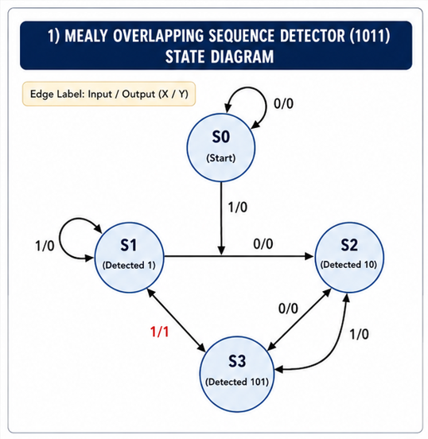
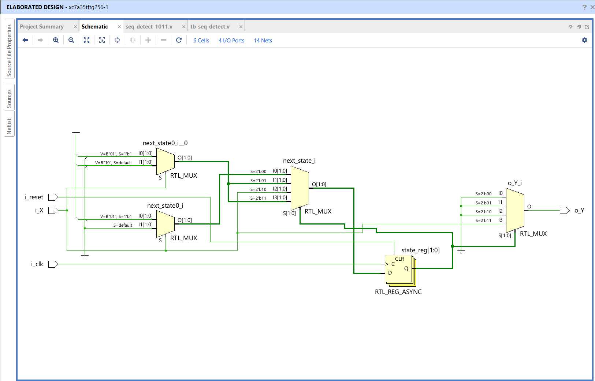
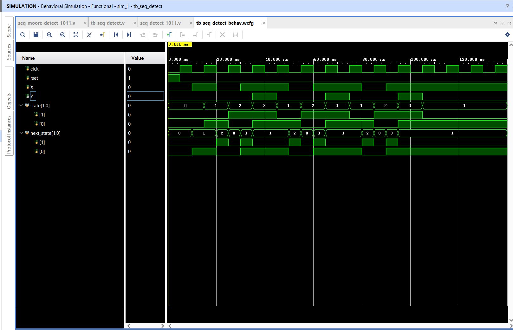
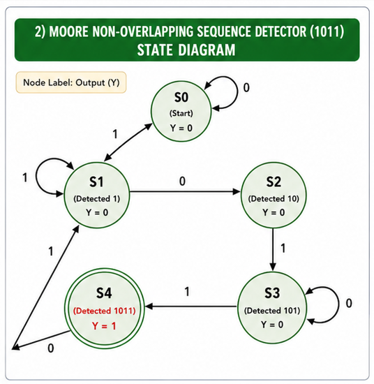
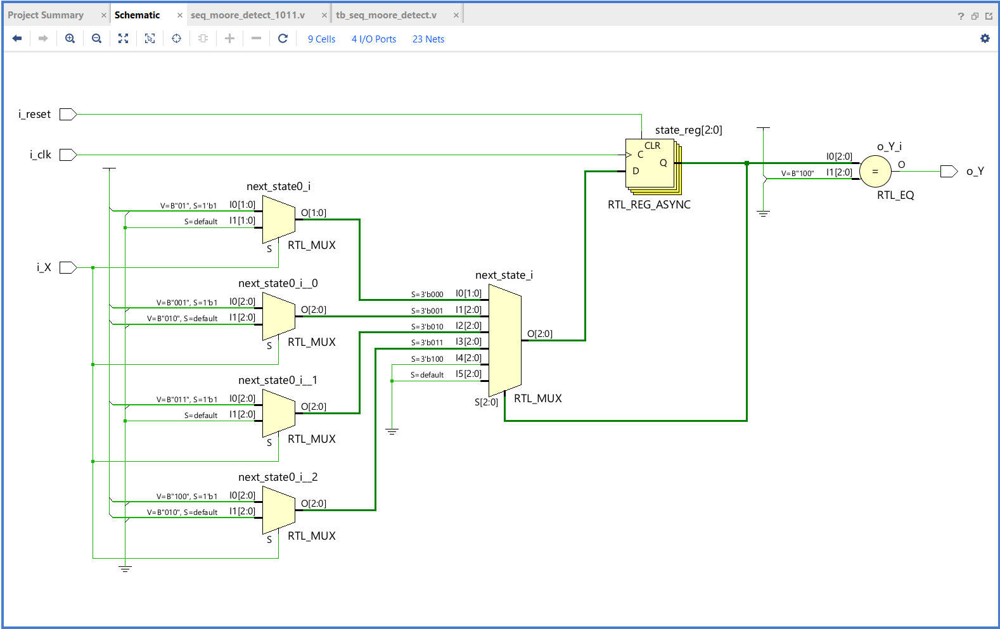
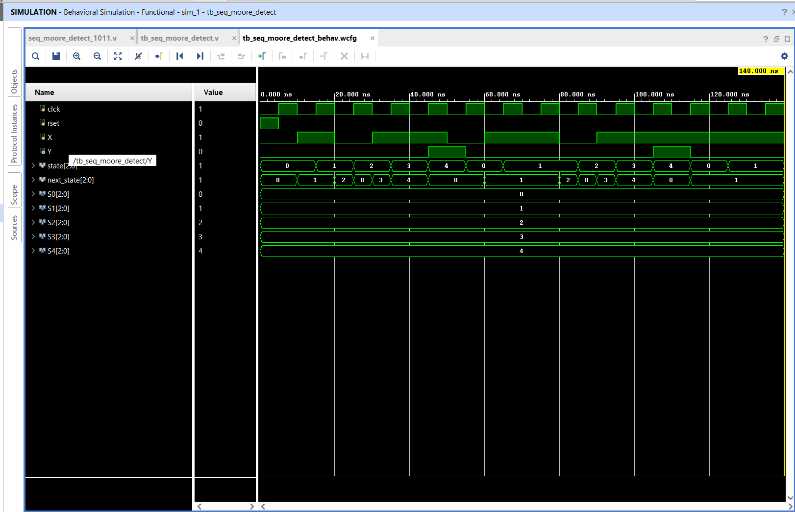

# Sequence Detector (1011) using Verilog HDL

> A Finite State Machine (FSM) based implementation of a **1011 Sequence Detector** in Verilog HDL, featuring both **Mealy (Overlapping)** and **Moore (Non-overlapping)** architectures. The designs are verified using behavioral simulation in **AMD Vivado**.

---

## Project Overview

This project demonstrates the implementation of sequence detectors using Finite State Machines (FSMs). The detector continuously monitors a serial input stream and asserts an output whenever the binary sequence **1011** is detected.

Two implementations are included:

- **Mealy Sequence Detector (Overlapping)**
- **Moore Sequence Detector (Non-overlapping)**

The project was designed using **Verilog HDL** and verified through behavioral simulation in **AMD Vivado**.

---

## Repository Structure

```text
VLSI_Project1_SequenceDetector/
│
├── README.md
├── .gitignore
│
├── src/
│   ├── seq_detect_1011.v
│   └── seq_moore_detect_1011.v
│
├── testbench/
│   ├── tb_seq_detect.v
│   └── tb_seq_moore_detect.v
│
├── docs/
│   ├── 01_Project_Overview.md
│   ├── 02_Design_Explanation.md
│   ├── 03_Mealy_State_Diagram.png
│   ├── 04_Moore_State_Diagram.png
│   ├── 05_Mealy_State_Transition_Table.md
│   ├── 06_Moore_State_Transition_Table.md
│   ├── 07_Elaborated_Design/
│   ├── 08_Simulation_Results.md
│   └── 09_Conclusion.md
│
└── waveforms/
    ├── mealy_waveform.png
    └── moore_waveform.png
```

---

## Features

- Verilog HDL implementation
- Finite State Machine (FSM) design
- Mealy Machine (Overlapping)
- Moore Machine (Non-overlapping)
- Behavioral Modeling
- Behavioral Simulation
- Professional Testbenches
- State Diagrams
- State Transition Tables
- RTL (Elaborated Design)
- Simulation Waveforms

---

## Tools Used

| Tool | Purpose |
|------|---------|
| Verilog HDL | Hardware Description Language |
| AMD Vivado | Design & Simulation |
| Git | Version Control |
| GitHub | Project Hosting |

---

## State Diagrams

### Mealy FSM

> Located at:

```text
docs/03_Mealy_State_Diagram.png
```
## Mealy State Diagram

<p align="center">
  
</p>

## Mealy RTL (Elaborated Design)

<p align="center">
  
</p>

## Mealy Simulation Waveform

<p align="center">
  
</p>

### Moore FSM

> Located at:

```text
docs/04_Moore_State_Diagram.png
```
## Moore State Diagram

<p align="center">
  
</p>

## Moore RTL (Elaborated Design)

<p align="center">
  
</p>

## Moore Simulation Waveform

<p align="center">
  
</p>
---

## Simulation Results

Simulation waveforms are available in:

```text
waveforms/
```

The simulations verify:

- Correct state transitions
- Correct sequence detection
- Proper reset operation
- Expected output generation
- Successful behavioral verification

---

## Documentation

Detailed documentation is available in the `docs` folder.

| Document | Description |
|----------|-------------|
| 01_Project_Overview.md | Project objectives and overview |
| 02_Design_Explanation.md | FSM design methodology |
| 03-04 | State diagrams |
| 05-06 | State transition tables |
| 07 | RTL elaborated design |
| 08 | Simulation results |
| 09 | Project conclusion |

---

## Skills Demonstrated

- Verilog HDL
- Digital Logic Design
- Finite State Machines (FSM)
- Behavioral Modeling
- Sequential Circuit Design
- Testbench Development
- Simulation & Verification
- Git & GitHub Documentation

---

## Future Improvements

- Parameterized sequence detector
- User-selectable sequence detection
- FPGA implementation
- SystemVerilog version
- Functional coverage
- UVM-based verification

---

## How to Run

1. Open the project in AMD Vivado.
2. Add the Verilog source files.
3. Add the corresponding testbench.
4. Set the required testbench as the simulation top module.
5. Run **Behavioral Simulation**.
6. Observe the state transitions and output waveform.

---

## Author

**Loka Veera Sai Teja**

B.Tech – Electronic Communication and Engineering

IIIT Sri City

---

## License

This project is intended for learning, academic use, and portfolio demonstration.